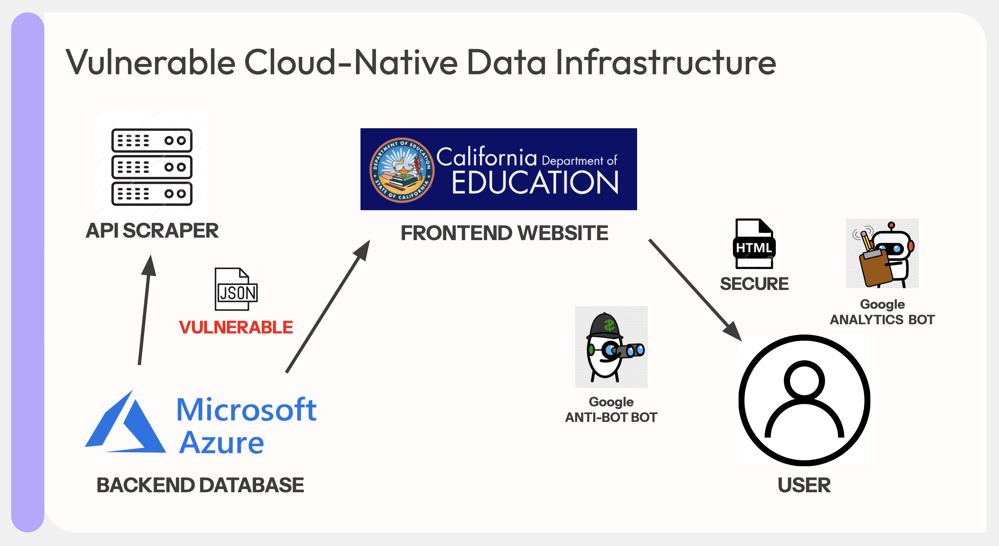
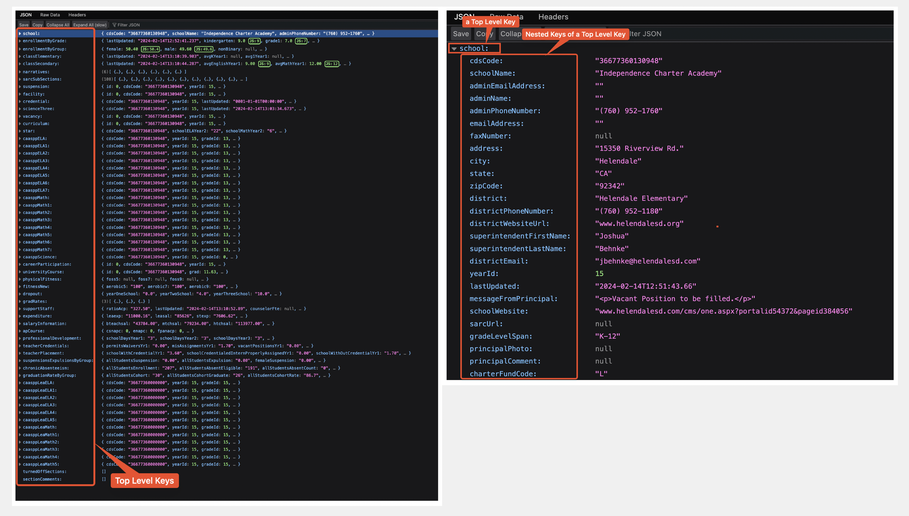
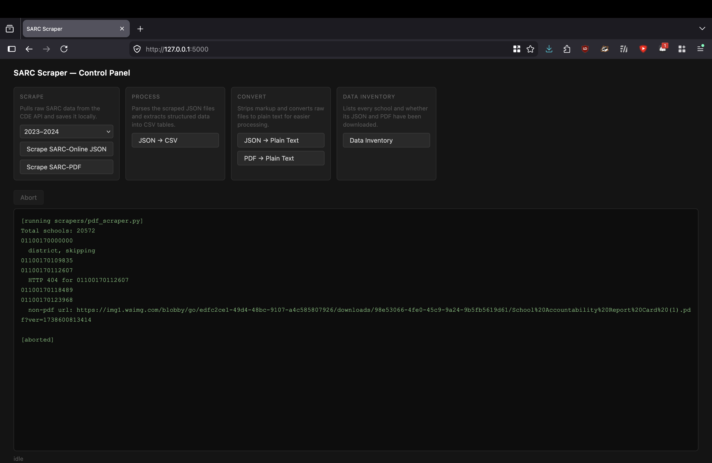

# SARC scraper

Scrapers and data processors for California School Accountability Report Cards (SARC). Includes both the SARC-online (JSON) and SARC-PDF pipelines.

This repo includes pre-scraped output files: 9,280 JSON files (2022–23) and 1,208 PDFs (2022–23), along with extracted CSVs and plain text conversions. New scrapes are saved to year-specific subdirectories (e.g. `outputs/json/2023-24/`).

---

## SARC-Online Scraper



The SARC online website outsources their server maintenance to Microsoft's Azure cloud web-services, which utilizes the JSON data structure to operate the website. Due to the public nature of the dataset, Azure had no verification process to acquire the JSON data even if you are not making a request through the website. The link format uses CDS codes to differentiate schools, making it quite simple to iterate through the list.

> **Update (July 2026):** CDE migrated from `sarc-prod-api-west.azurewebsites.net` (now NXDOMAIN) to `api.sarconline.org` (still ASP.NET/Kestrel on Azure). The new endpoint behaves identically—no authentication required, same JSON schema, same CDS-based URI structure. The scraper has been updated accordingly.

JSON data is much easier and simpler to manage and scrape—it is a lightweight text file with consistent formatting. The raw JSON data is quite literally a wall of text that fills your entire screen, so the scraper adds indents during the download to make it human readable; this has no effect on machine readability.



Of the ~19,750 schools in the Public School Directory, 9,280 JSON files were scraped, amounting to about **48% coverage** and **4.4GB** of data. SARC online seems to be a popular alternative to the PDF format. The scraper only scanned CDS codes present in `school_list.csv`, so if a CDS code is missing from that file, that school was missed.

The JSON dataset is comprehensive in detail—it is literally the raw data of the webpage—but limited in the specific data points this study is looking for. It has an entire section at the top level dedicated to facility conditions, but it only contains self-reported facility quality ratings. The year a school was built is not one of the data points, though it is sometimes mentioned passingly in the school's background/history section.

**The scraping takes about 13 hours each (about 26 hours for both online and pdf).** The bottleneck is not the internet connection but the artificial delays—the scraper takes a 2-second break between every request. Without that delay the scraping will disrupt Azure servers amounting to a DDoS attack. Even with the delay, use a VPN during scraping to avoid the school's IP address getting blacklisted.

The scraper encounters three scenarios:

1. A plain-text response: `"Cannot view report prior to finalization."`—They broke JSON standards for this error message, causing the website to only display the plain text. Since this scrapes 2022–23 reports, these will likely never be finalized.
2. A valid JSON error: `"Object reference not set to an instance of an object."`—The link is invalid, indicating the school chose not to participate in the SARC online program.
3. Valid JSON—downloaded and saved.

---

## SARC-PDF Scraper

The SARC website also structures its links using CDS codes, making it simple to iterate. About **1,208 PDFs** were downloaded (2022–23), amounting to roughly **6% of schools**.

The scraper can only download a file if the "View Full SARC" button links directly to a PDF. It cannot download files where the button links to a website containing the PDF, or to a Google Drive. The missing coverage can be attributed to a combination of those cases, un-finalized reports, and non-compliance.

> **Update (July 2026):** After CDE's migration, the API moved to `api.sarconline.org`. The scraper has been updated accordingly.

Unlike the SARC online JSON, PDF formats are much more inconsistent. They contain a chart of self-reported facility quality and sometimes include the year the school was built. An LLM would likely be effective at extracting specific data points from these PDFs.

---

## Project Structure

| Path | Description |
|------|-------------|
| `app.py` | Flask control panel, run scripts and view output in the browser |
| `scrapers/online_scraper.py` | Downloads SARC JSON per school |
| `scrapers/pdf_scraper.py` | Downloads SARC PDFs per school |
| `processors/extract_school.py` | JSON → school-level CSV |
| `processors/extract_facilities.py` | JSON → facility inspection CSV |
| `processors/extract_building_info.py` | Plain text → year built and square footage CSV |
| `processors/json_to_csv.py` | Field schemas for all JSON sections; CLI for any section → CSV |
| `processors/json_to_text.py` | JSON → plain text (strips HTML/markup) |
| `processors/pdf_to_text.py` | PDF → plain text |
| `inventory.py` | Lists which schools have JSON and/or PDF downloaded |
| `pdf_web_scraper/` | General-purpose PDF web crawler (MIT license, third-party) |
| `inputs/school_list.csv` | CA public school list with CDS codes (CDE, Dec 2024) |
| `inputs/district_contacts.csv` | District contact info |
| `outputs/json/` | Scraped JSON files (4.4GB) |
| `outputs/pdfs/` | Scraped PDF files (~800MB) |
| `outputs/text/` | Extracted plain text |
| `outputs/csv/` | Processed CSV tables |

---

## UI Setup

```bash
pip install -r requirements.txt
python app.py
```

Then open `http://127.0.0.1:5000` in your browser. The control panel lets you run any script and see its output live. All scripts can also be run directly from the command line—see the Usage section below.

Use a VPN before running either scraper.



---

## CLI Usage

Run all scripts from the repo root.

**Scrape SARC-Online JSON:**
```bash
python scrapers/online_scraper.py
# → outputs/json/{cds_code}.json
```

**Scrape SARC-PDF:**
```bash
python scrapers/pdf_scraper.py
# → outputs/pdfs/{cds_code}.pdf
```

**Extract structured data to CSV:**
```bash
python processors/extract_school.py        # → outputs/csv/school_data.csv
python processors/extract_facilities.py    # → outputs/csv/facilities_data.csv
python processors/extract_building_info.py # → outputs/csv/building_info.csv
```

**Extract any JSON section to CSV:**
```bash
python processors/json_to_csv.py <section> outputs/json outputs/csv/<section>.csv
```
Available sections: `school`, `enrollmentByGrade`, `enrollmentByGroup`, `classElementary`, `classSecondary`, `suspension`, `facility`, `credential`, `scienceThree`, `vacancy`, `curriculum`, `star`, `caasppELA`, `caasppELA1`–`7`, `caasppMath`, `caasppMath1`–`7`, `caasppScience`

**Convert JSON / PDF to plain text:**
```bash
python processors/json_to_text.py  # → outputs/text/online/{cds_code}.txt
python processors/pdf_to_text.py   # → outputs/text/pdf/{cds_code}.txt
```

**Data inventory:**
```bash
python inventory.py
```

---

## pdf_web_scraper

`pdf_web_scraper/` is a general-purpose PDF web crawler not specific to SARC—it finds and downloads PDFs from any website by crawling pages. See `pdf_web_scraper/README.md` for usage. Released under the MIT license by its original author.
